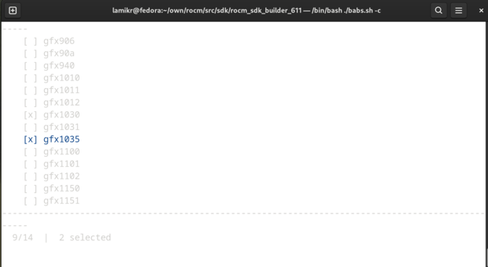

# ROCM SDK Builder

## Purpose

ROCM SDK Builder will provide an easy and customizable build and install of AMD ROCm machine learning environment for your Linux computer with the support for user level GPUs.  

In addition of the ROCm basic applications and libraries, the system will also install locally a version of tools like python, pytorch and jupyter-notebook that has been tested to work with rest of the system. SDK will be installed under /opt/rocm_sdk_<version> directory.

Latest ROCM release supported is the ROCM 6.1.1 which also builds rocBLASLt, hibBLASLt and AMDMIGrapX as a newest components for pytorch. The usage of AMDMIGraphX has however not been tested yet.

This project has been so far tested with following AMD GPUs:

- AMD RX 6800
- AMD RX 5700
- AMD Mobile m680i


## Installation Requirements

ROCM SDK Builder has been tested on Mageia 9, Fedora 39 and Ubuntu 230.10 Linux distributions.

Build system itself has been written with bash shell language to limit external dependencies to minimal but the applications build and installed will naturally have their own build time dependencies.

On Mageia, Fedora and Ubuntu these dependencies, the build time dependencies can be installed by executing a script:

```
# ./install_deps.sh
```

To reduce the run-time dependency variance between different distributions, the build system will itself build and install standalone python 3.9 which seems to be pretty trouble-free version with the currently used pytorch rocm-components.

You need to also to use git configure command to set git username and email address, otherwise the 'git am' command that the project uses for applying patches on top of the upstream code versions will fail. This can be done in a following way.

```
# git config --global user.name "John Doe"
# git config --global user.email johndoe@example.com
```

ROCM SDK Builder will require about 130 GB of free space to build the newest rocm 6.1.1 version. This is mostly divided in a following way:

```
- src_projects directory, for source code, about 30 GB
- builddir directory for temporarily files, about 75 GB
- /opt/rocm_sdk_611, install directory for the sdk, about 20 GB
```

Once the build is ready, 'builddir' and 'src_projects' directories could be deleted to free more space. As the downloading the sources from scratch can take some, I recommend keeping at least the source directory.

## Installation Directory and Environment Variables

ROCM SDK Builder will by default install the SDK to /opt/rocm_sdk_<version> directory.  To set the paths and other environment variables required to execute the applications installed by the SDK can be loaded by executing a command:

```
# source /opt/rock_sdk_<version>/bin/env_rocm.sh
```

## How to Build and Install ROCm SDK

Following commands will download rocm sdk 6.1.1 project sources and then build and install the rocm_sdk version 6.1.1 to /opt/rocm_sdk_611 folder.

```
# git clone https://github.com/lamikr/rocm_sdk_builder.git
# cd rocm_sdk_builder
# git checkout releases/rocm_sdk_builder_611
# ./babs.sh -i
# ./babs.sh -b
```

SDK will pop-up the GPU selection fro the SDK build targets before the build will start
and selections will be stored to build_cfg.user file.
Configuration can also be done afterwards with ./babs.sh -c command.
Note that build-configuration change does not automatically cause a rebuild
of already builded projects. To force that you need to remove projects you want
to rebuild from builddir folder. To force rebuilding everything you simply remove
the 'builddir' directoty completely.



## How to get started for using the installed SDK

Following command should give you information related to your installed AMD GPU.

```
# source /opt/rocm_sdk_611/bin/env_rocm.sh
# rocminfo
```

Following command will open pytorch project to test your GPU. (Note that AMD gpus are listed as a cuda GPU's on pytorch)

```
# source /opt/rocm_sdk_611/bin/env_rocm.sh
# jupyter-notebook /opt/rocm_sdk_611/docs/examples/pytorch/pytorch_amd_gpu_intro.ipynb
```

Details howto use the other ROCm components like rocBLAS, rocPRIM, etc. will be added later.

## Customizing the SDK Build

Here is shortish but more detailed information how the SDK will work and can be modified.

### Selecting the GPUs for which to build the SDK

GPU's can be selected with ./babs -c option which opens checkbox and selects results to build_cfg.user file
```
./babs.sh -c
```

List of supported GPU's should be relatively easy to add, at the moment I have only added support for the one I have been able to test by myself. At some point, I had also the support working for older AMD G2400 but I have not had time to integrate those changes to newer rocm sdk. (Had it working for rocm sdk 3.0.0)

### Adding New Projects to SDK for build and install

New projects can be added to builder by modifying files in binfo directory.

- First you need to create the <build_order_number>_<name>.binfo file where you specify details for the project like source code location, configure flags and build commands. By default the build system will use cmake and make commands for building the projects, but you can override those by supplying your BINFO array commands if the projects standard install command needs some customization.
You can check details for those from the existing .binfo files but principle is following:

```
BINFO_APP_POST_INSTALL_CMD_ARRAY=(
    "if [ ! -e ${INSTALL_DIR_PREFIX_SDK_ROOT}/lib/cmake ]; then mkdir -p ${INSTALL_DIR_PREFIX_SDK_ROOT}/lib/cmake; fi"
    "if [ ! -e ${INSTALL_DIR_PREFIX_SDK_ROOT}/lib/libhsakmt.so ]; then ln -s ${INSTALL_DIR_PREFIX_SDK_ROOT}/lib/libhsakmt.so.1 ${INSTALL_DIR_PREFIX_SDK_ROOT}/lib/libhsakmt.so; fi"
}
```

- Then you will need to add your <build_order_number>_<name>.binfo file to binfo/binfo_list.sh file.
 
### ROCM SDK Builder Major Components

- babs.sh, build/build.sh and build/binfo_utils.sh provides the framework for the build system and can be used more or less without modifications also on other projects. You can get help for available babs (acronym babs ain't patch build system)) commands with the '-h' argument.

```
[lamikr@localhost rocm_sdk_builder (master)]$ ./babs.sh -h
babs (babs ain't patch build system)

usage:
-h or --help:           Show this help
-i or --init:           Download git repositories listed in binfo directory to 'src_projects' directory
                        and apply all patches from 'patches' directory.
-ap or --apply_patches: Scan 'patches/rocm-version' directory and apply each patch
                        on top of the repositories in 'src_projects' directory.
-co or --checkout:      Checkout version listed in binfo files for each git repository in src_projects directory.
                        Apply of patches of top of the checked out version needs to be performed separately with '-ap' command.
-f or --fetch:          Fetch latest source code for all repositories.
                        Checkout of fetched sources needs to be performed separately with '-co' command.
                        Possible subprojects needs to be fetched separately with '-fs' command. (after '-co' and '-ap')
-fs or --fetch_submod:  Fetch and checkout git submodules for all repositories which have them.
-b or --build:          Start or continue the building of rocm_sdk.
                        Build files are located under 'builddir' directory and install is done under '/opt/rocm_sdk_version' directory.
-v or --version:        Show babs build system version information
```

- binfo folder contains the recipes for each projects which is wanted to be build. These recipes does not have support for listing the dependencies by purpose and insted the build order is managed in binfo/binfo_list.sh file.

- patches directory contains the patches that are wanted to add on top of the each project that is downloaded from their upstream repository

- src_projects is the directory under each sub-project source code is downloaded from internet.

- builddir is the location where each project is build before install and work as a temporarily work environment. Build system can be cleaned to force the rebuild either by removing individual projects from builddir folder or by removing the whole projecs. More detailed  specific tuning is also possible by deleting build-phase result files.
(builddir/project/.result_preconfig/config/postconfig/build/install/postinstall)

## Rebuilding Individual Projects

Rebuilding of individual projects can be triggered in two different ways if you have made for example some changes to project source code under the 'src_projects' directory: Note that builder will always build projects in an order listed in the binfo/binfo_list.sh file.

- deleting the project specific directory from the builddir
- removing the .result_* files under the build directory.

For example:

```
# rm -rf builddir/037_magma (would trigger to re-run all build phases)
# rm -f builddir/037_magma/.result_install (would trigger to re-run only the install phase)
# ./babs.sh -b
```

## Additional build commands

./babs.sh has also following commands:

```
# ./babs.sh -co (checkouts the sources back to basic level for all projects)
# ./babs.sh -ap (apply patches to checked sources for all projects)
# ./babs.sh -f (fetch latest sources for all projects)
# ./babsh.sh -fs (fetch latest sources for all projects all submodules)
```

## GPU benchmarks

- Very simple benchmark is available on by executing command:

```
# source /opt/rocm_sdk_611/bin/env_rocm.sh
# jupyter-notebook /opt/rocm_sdk_611/docs/examples/pytorch/pytorch_simple_cpu_vs_gpu_benchmark.ipynb
```


- more extensive GPU benchmark originally used with NVIDIA gpu's is available here. I have made some modifications to original benchmarks to update it to run with the newer pytorch and python numpy.

```
# git clone https://github.com/lamikr/pytorch-gpu-benchmark
# cd pytorch-gpu-benchmark
# source /opt/rocm_sdk_/bin/env_rocm.sh
# ./test_with_torchvision_013.sh script
```

Copyright (C) 2024 by Mika Laitio <lamikr@gmail.com> 
Some of the files in this project are licensed with the LGPL 2.1 and some other with the COFFEEWARE license.  
See the COPYING file for details.
