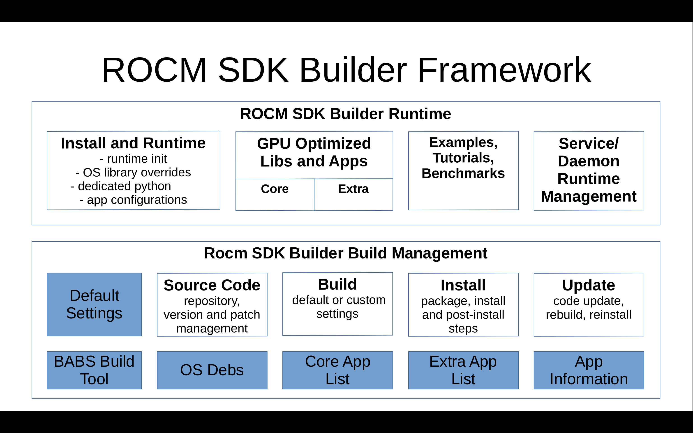

# ROCM SDK Builder Briefly

ROCM SDK Builder provides easy and convenient machine learning and GPU computing development environment by using single or multiple regular consumer level GPUs on PC and laptop environments.

It builds and integrates AMD¨s ROCm machine learning stack and other common ML Tools and models to easy to use environment. It is especially targeting the consumer Level discrete and integrated GPUs available on desktops and laptops.

Latest ROCM SDK Builder 6.1.2 release is based on to source code of AMD's ROCM 6.1.2 base libraries with additional patches to tune and add support for additional GPUs. In addition an increasing number of additional libraries and applications has been integrated on top of it.

Testing of different GPUs and Linux distributions is mainly done by a users and developers and tracked in tickets.


## Supported GPUs

This project has been so far tested with the following AMD Radeon GPUs:

- AMD RX 7900 XTX (gfx1100)
- AMD RX 7800 XT (gfx1101)
- AMD RX 7700S/Framework Laptop 16 (gfx1102)
- AMD Radeon 780M Laptop iGPU (gfx1103)
- AMD RX 6800 XT (gfx1030)
- AMD RX 6800 (gfx1030)
- AMD RX 6600 (gfx1032)
- AMD RX 5700 (gfx1010)
- AMD Radeon Pro V520 (gfx1011)
- AMD RX 5500 (gfx1012)
- AMD Radeon 680M Laptop iGPU (gfx1035)
- AMD Raphael iGPU (gfx1036) (desktops)
- AMD Strix Point iGPU (gfx1150) / (Experimental support, testing and feedback needed)
- AMD Strix Halo iGPU (gfx1151) / (Experimental support)
- Radeon VII (gfx906) / (Experimental support)
- MI50 CDNA (gfx906) / (Tested recently)
- MI100 CDNA (gfx908) / (Experimental support)
- MI210/250 CDNA (gfx90a) / (Experimental support)
- MI300A/MI300X CDNA (gfx940, gfx941, gfx942) / (Experimental support)
- AMD XDNA/XDNA2 NPU (experimental support, requires also xdna drivers to be patched to kernel)

Older GPUs having 8GB of memory or less may not be able to run the memory extensive benchmarks and applications but there are many application where they will still work well compared to CPU based opeations.

Some GPU's have been benchmarked after building the ROCM SDK Builder with the benchmark available at https://github.com/lamikr/pytorch-gpu-benchmark/


## Supported Linux Distributions

Tested and officially supported Linux distributions:

- Fedora 40
- Ubuntu 24.04
- Ubuntu 22.04 (python 3.10 is build instead of 3.11)
- Mageia 9
- Arch Linux
- Manjaro Linux
- Void Linux
- Mint Linux 21

Thanks by the many users and developers who have contributed to ROCM SDK Builder, the list of supported Linux distros have increased signigicatly after the initial release. Manjaro and Arch Linux are rolling releases and therefore their status needs to be verified more often.


# Build and Install

babs.sh is the command line interface that is used for most of the rocm sdk builder tasks. It provides an interface to control the download, patch, configure, build, install and update either single application or a list of applications.

Following set of commands below will download rocm sdk 6.1.2 project sources and then build and install it to directory /opt/rocm_sdk_612

```
# git clone https://github.com/lamikr/rocm_sdk_builder.git
# cd rocm_sdk_builder
# git checkout releases/rocm_sdk_builder_612
# ./install_deps.sh
# ./babs.sh -c
# ./babs.sh -i
# ./babs.sh -b
```

Below these commands are described more in detail.

## Download Source Code

```
# git clone https://github.com/lamikr/rocm_sdk_builder.git
# cd rocm_sdk_builder
# git checkout releases/rocm_sdk_builder_612
```

## Install Linux Distibution Specific Dependencies

```
# ./install_deps.sh
```

In the end of the execution, install_debs.sh will check whether you have configured git and access to AMD GPU device driver properly. If either of these have problem, install_deps.sh will printout in the end instructions how to fix the problem.

Git user.name and email address configuration is needed because ROCM SDK builder uses git-am command for applying patches on top of the projects source code and git am itself requires that they are configured. This can be done for example in a following way if not alrady set up.

```
# git config --global user.name "John Doe"
# git config --global user.email johndoe@example.com
```

Access to GPU is not needed during the build time but it's needed while running the applications later on ROCM SDK Builder environment. Some users have tested this by building the environment on virtual linux machines which does not have access to their GPU's and then later installing the system to more isolated production environments where the devices does not have direct internet access.


## Select Build Target GPU's

Many of the files needs to build on libraries for each GPU separately, so for regular builds you should really select only your GPUs to save significant amout of build time.

Selections will be stored to build_cfg.user file. If this file will not exist, the selection dialog is also showed automaticlly before the many other babs.sh commands.

```
# ./babs.sh -c
```


## Build the ROCM SDK Builder Core

Note that the babs.sh -i command is not strictly required. That command will download source code for all projects in advance instead of downloading them one by one while the build progress. This is a new feature starting from the rocm sdk builder 6.1.2.

Build is installed automatically to /opt/rocm_sdk_612 directory but it is possible to change this by specifying the INSTALL_DIR_PREFIX_SDK_ROOT environment variable in envsetup_user.sh file.
Check the envsetup_user_template.sh for further information.

```
# ./babs.sh -i
# ./babs.sh -b
```

... get some good coffee beans... grind ... brew ... enjoy ...
It will take usually 5-10 hours to get everything build from scratch depending your machine.

## Source Code and Build Update

Babs.sh provides now as a new command since 6.1.2 version an update command which can be used on updating the source code in a way that it will check which projects has been updated. For updated projects the build dir is cleaned so that they are easy to rebuild.


```
# ./babs.sh -up
# ./babs.sh -b
```

Command will accept the git branch name where to checkout as an optional parameter. Note that update command does not check binfo files which does not belong to any blist files in binfo/extra directory.


# ROCM SDK Builder Usage Examples

Following examples show how to run various types of applications in the builder ROCM SDK BUILDER environment.

There is a lot of more examples under docs/examples folder related to different subjects but these help you to get started.

## Play and Manipulate Audio Recordings with Pytorch Audio

By default the pytorch audio supports the audio playback on Mac computers, but rocm sdk builder have patched it to do the playback also on Linux. At the moment implementation is done by using the ffmpeg but we are looking also for other alternavives like SDL for future.

```
# cd /opt/rocm_sdk_612/docs/examples/pytorch/audio
# ./pytorch_audio_play_effects.sh
```

## Viewing GPU Information

rocminfo, amd-smi, rocm-smi and nvtop are usefull tools that can be used to query and monitor for example the memory usage, clock frequencies and temperatures.

Note that command 'source /opt/rocm_sdk_612/bin/env_rocm.sh' needs to be run once on each terminal to set up environment variables and patch correctly.

```
# rocminfo
```

This will print out details about your detected CPUs and GPUs that can be used for running applications in ROCM SDK environment.


```
# amd-smi metric
```

## Building Hello World GPU Example App

This will show how to build from source and then run the hello world type example application from document directory.
Application loads HIP kernel to your GPU, sends data from the userspace to GPU where the kernel changes it and sends back to userspace. Userspace will then print the received data. 


```
# source /opt/rocm_sdk_612/bin/env_rocm.sh
# cd /opt/rocm_sdk_612/docs/examples/hipcc/hello_world
# ./build.sh
```

You should expect to see a following output if the application can communicate with your GPU.


```
./hello_world
 System minor: 3
 System major: 10
 Agent name: AMD Radeon Graphics
Kernel input: GdkknVnqkc
Executing GPU kernel task to increases each input character by one...
Kernel output: HelloWorld
Output string matched with the expected text: HelloWorld
Test ok!
```

## Simple CPU vs GPU benchmarks

Very simple benchmark that shows how to run the same math operation both in the CPU and GPU is available on as pytorch program which can be run on jupyter notebook. On CPU the expected time is usually around 20-30 seconds. It can be executed with these commands:

```
# source /opt/rocm_sdk_612/bin/env_rocm.sh
# cd /opt/rocm_sdk_612/docs/examples/pytorch
# ./pytorch_simple_cpu_vs_gpu_benchmark.sh
```


## Test Pytoch with Jupyter-Notebook

```
# source /opt/rocm_sdk_612/bin/env_rocm.sh
# cd /opt/rocm_sdk_612/docs/examples/pytorch
# ./pytorch_gpu_hello_world_jupyter.sh
```	


## Extra AI Tools

ROCM SDK Builder has defines ai_tools.blist file which can be used to build 3 commonly known AI tool that can be used for running LLM models for chat type communication and image geneation. Application included are:

- llama.cpp
- VLLM
- statble-diffusion-webui

They can all utilize the AMD GPU's and can be build with the following commands.

```
# cd rocm_sdk_builder
# ./babs.sh -b binfo/extra/ai_tools.blist
```

## Test LLAMA.CPP

```
# source /opt/rocm_sdk_612/bin/env_rocm.sh
# llama-server_rocm.sh
```
- llama.cpp will create server on address http://127.0.0.1:8080
- Launch your browser to access the server and test chat-ui: http://127.0.0.1:8080

## Test stable-diffusion.cpp

```
# curl -L https://huggingface.co/Comfy-Org/stable-diffusion-v1-5-archive/resolve/main/v1-5-pruned-emaonly-fp16.safetensors --output-dir /opt/rocm_sdk_models/ -o sd-v1-5-pruned-emaonly-fp16.safetensors
# source /opt/rocm_sdk_612/bin/env_rocm.sh
# sd -M txt2img -p "a cat" -m /opt/rocm_sdk_models/sd-v1-5-pruned-emaonly-fp16.safetensors -o ~/Pictures/test_cat.png
```
- stable-diffusion.cpp will run and create the image of a cat and save it in the Pictures folder

## Test Stable Diffusion WebUI

```
# cd /opt/rocm_sdk_612/apps/stable-diffusion-webui
# ./webui.sh
```

- Stable Diffusion WebUI will create server on address http://127.0.0.1:7860/
- Launch your browser to access the server and test the image generation from text description: http://127.0.0.1:7860/
- On first launch the stable diffusion webui initialization and image generation takes some time, because it downloads the model file to /opt/rocm_sdk_models directory before initializing the web server for ui.
- Try to set "Sampling steps" in UI to be first less than 20, for example to 5. I have seen errors to generate images on many GPU's if it is using 20 steps.

## Test VLLM

```
# cd /opt/rocm_sdk_612/docs/examples/llm/vllm
# ./test_questions_and_answers.sh
```
Note: It may take a while for the first run to download the model on first time to /opt/rocm_sdk_models/vllm directory and then to run the question/answer example.

If you encounter the error: ```ModuleNotFoundError: No module named 'vllm'```, please rebuild the vllm module individually as described below. 
If the issue persists and you see the message No files found to uninstall, try forcing the reinstallation using the following command:
```
# cd rocm_sdk_builder
# pip install ./packages/whl/vllm+<version>.whl --force-reinstall --no-deps
```

## Run Full GPU Benchmarks

External Benchmark originally made for NVIDIA cards is available here. Upstream does not seems to be anymore active so the benchmark is now available here.

https://github.com/lamikr/pytorch-gpu-benchmark/

AMD GPU specific results have been run either on ROCM SDK Builder 6.11 or 6.12 environment. As the same commands for downloading the benchmarks will now run more tests than couple of years ago, the newer tests requiring much more memory, the benchmark has been tweaked to check the available GPU memory and then using that information to determine if to run all or only a subset of tests.

For many GPU's the benchmark results have improved significantly from 6.1.1 release thanks to improvements made to tuning made ROCBLAS, Composable Kernel and FFTW.

## Test AMD's XDNA/XDNA NPU (new AMD 2024/2025 hw)

ROCM SDK Builder has integrated initial XDNA userspace software stack support for testing and application development purposes.

- peanu llvm-aie compiler for xdna/xdna2 NPUs
- xilinx xrt runtime required by xdna
- xrt-xdna plugin to manage the application load via xrt runtime to xdna
- test application to verify the functionality

In addition you will need to build kernel with xdna driver and xdna firmware
as it is not yet available on any Linux distribution kernels. (expected to be in upstream kernel on 6.14)

Copy xdna firmware files to /lib/firmware/amdnpu folder if they are there yet.
Little newer firmware version may be available on https://github.com/amd/xdna-driver

```
git clone https://kernel.googlesource.com/pub/scm/linux/kernel/git/firmware/linux-firmware.git
sudo mkdir /lib/firmware/amdnpu/1502_00/
sudo cp linux-firmware/amdnpu/1502_00/npu.sbin.1.5.2.380 /lib/firmware/amdnpu/1502_00/npu.sbin
...
do same also for other subfolders like 17f0_10, 17f0_11, 17f0_20
```

Build kernel from xdna kernel branch available on https://github.com/lamikr/linux

```
git clone https://github.com/lamikr/linux
cd linux
git checkout release/613rc7_xdna_driver
./kernel_build.sh
```

Reboot and check that amdxdna driver gets loaded

```
dmesg | grep amdxdna
```

If xdna driver worked and was able to load the firmware, you should see message like: "Initialized amdxdna_accel_driver"

If xdna driver failed to find the firmware, you should see a this type of message from kernel dmesg: "npu.sbin failed with error -2".
In case of error, you may need to force the firmware files to get copied to initrd image. At least of Fedora 40 that can be done with command:

```
"dracut -f -i /lib/firmware /lib/firmware
```

Build userspace application

```
# ./babs.sh -b binfo/extra/amd-aie.blist
```

And tested with command

```
# source /opt/rock_sdk_<version>/bin/env_rocm.sh
# example_noop_test /opt/rocm_sdk_612/apps/aie/tools/bins/1502_00/validate.xclbin
```

Which should printout following output:

```
    Host test code start...
    Host test code is creating device object...
    Host test code is loading xclbin object...
    Host test code is creating kernel object...
    Host test code kernel name: DPU_PDI_0
    Host code is registering xclbin to the device...
    Host code is creating hw_context...
    Host test code is creating kernel object...
    Host test code allocate buffer objects...
    Host test code sync buffer objects to device...
    Host test code iterations (~10 seconds): 70000
    Host test microseconds: 4640738
    Host test average latency: 66 us/iter
    TEST PASSED!
```

# Commonly Used Babs.sh Commands

Get help from the commands

```
# ./babs.sh -h
```

Update the ROCM SDK Builder to latest version in current branch and then check if project specific binfo or patch directories have been updated.
Do the source code checkout, apply patches and clean commands for all changed projects so that they can be rebuild.
Check the end of the command output for instructions how to re-build the updated projects.

```
# ./babs.sh -up
```

Update the ROCM SDK Builder to latest version in git master branch and then check if project specific binfo or patch directories have been updated.
Do the source code checkout, apply patches and clean commands for all changed projects so that they can be rebuild.
Check the end of the command output for instructions how to re-build the updated projects.

```
# ./babs.sh -up master
```

Checkout and apply patches to all core projects

```
# ./babs.sh -ca
```

Checkout and apply patches to binfo/extra/ai_tools.blist

```
# ./babs.sh -ca binfo/extra/ai_tools.blist
```

Update ROCM SDK Buider to latest version in current branch, apply new patches added to ai_tools project list and rebuild all changed ai_tools projects

```
# cd rocm_sdk_builder
# ./babs.sh -up
# ./babs.sh -b binfo/extra/ai_tools.blist
```

Or alternatively do same in steps with separate git pull, babs.sh commands. Note that this will rebuild all ai_tools projects, not only the updated ones.

```
# cd rocm_sdk_builder
# git pull
# ./babs.sh --clean binfo/extra/ai_tools.blist
# ./babs.sh -ca binfo/extra/ai_tools.blist
# ./babs.sh -b binfo/extra/ai_tools.blist
```

Update ROCM SDK Buider to latest version, apply new patches added to VLLM project and rebuild VLLM

```
# cd rocm_sdk_builder
# git pull
# ./babs.sh --clean binfo/extra/vllm.binfo
# ./babs.sh -ca binfo/extra/vllm.blist
# ./babs.sh -b binfo/extra/vllm.blist
```
## Other Babs.sh Commands

Checkouts the sources back to basic level for all projects without applying patches

```
# ./babs.sh -co
```

Apply patches on top of the checked out versions of projects

```
# ./babs.sh -ap
```

Fetch latest source code from repositories but do not do checkout

```
# ./babs.sh -f
```

# Development Tips and Customizations

## Change Default Build Variables

Default install directory and CPU count used for doing the build can be overrided in file envsetup_user.sh.
You can do this with following steps:

1) copy envsetup_user_template.sh to envsetup_user.sh

```
cp envsetup_user_template.sh envsetup_user.sh
```

2) Uncomment and define the desired variables in file envsetup_user.sh by removing the '#'-character from the beginning of the line for variables you wan to override

```
#export INSTALL_DIR_PREFIX_SDK_AI_MODELS=~/rocm/rocm_sdk_models
#export INSTALL_DIR_PREFIX_SDK_ROOT=~/rocm/rocm_sdk_612
#export BUILD_CPU_COUNT_DEFAULT=8
#export BUILD_CPU_COUNT_MODERATE=8
#export BUILD_CPU_COUNT_SAFE=8
```

## New Project Creation

New projects can be added to ROCM SDK Builder by creating a new binfo-file to binfo/extra directory. It is recommended to use existing binfo-files as a template.

Optionally the binfo-file can then also be added to either new or existing blist-file in binfo/extra directory.

Easiest way to test the binfo-file is to use the following command then to build it:

```
# ./babs.sh -b binfo/extra/my_app.binfo
```

And to force the execution of all build phases.

```
# ./babs.sh --clean binfo/extra/my_app.binfo
# ./babs.sh -b binfo/extra/my_app.binfo
```

## Creation of Project Specific Patches

Project specific patches are located in directory patches/rocm-x.y.z/appname. They need to be in format that git am can apply them after checking out application version that has been specified in the applications binfo-file.

# ROCM SDK Builder Architecture Specification

ROCM SDK Builder build system itself has been written with bash shell language to limit external dependencies on minimal in the basic linux command line tools.

It build own python instance that is used for installing and running the python apps on the ROCM SDK environment in one if it's first steps during the build.

Linux distro compability specific checks verifying that it has all the required applications installed is handled by the install_deps.sh file.

Babs.sh is the main tool in ROCM SDK Builder and it is designed to checkout, patch, build and install either single application, list of core applications or list of extra applications.

Applications are all installed inside the isolated directory structure under /opt/rocm_sdk_xyz directory and also the typical configurations files are located there in /opt/rocm_sdk_xyz/etc directory.

Applications which are downloading the large model files for example from the HuggingFace, are typically configured to download files to /opt/rocm_sdk_models directory. All the documentations in examples are also guiding to use that directory. In this way same models can be shared between multiple different ROCM SDK Builder versions easily.

[Libreoffice presentation](docs/presentations/rocm_sdk_builder.odt)

[Same as a Powerpoint presentation](docs/presentations/rocm_sdk_builder.pptx)



# ROCM SDK Builder Provides

- Integrated environment targeting to build Machine Learning environment fully from the source code
- Machine learning Runtime environment for AMD GPUs
- ROCM SDK Builder Core which is build and installed by default provides most essential ML applications and tools optimized for AMD consumer level Radeon GPUs. This includes Pytoch/cuda runtime with AMD GPUs.
- Optional extra applications that can be build and installed on top of the core. (Stable diffusion webui, whisper, llama.cpp, VLLM, Jax, etc.)
- C/C++/Python ML and HTCP example applications with source code for learning and testing purposes.
- Development environment developing and testing either single GPU or multi-GPU machine learning applications.

## Main Components

### Core and Extra

Application is classified being either the core or extra application. Core applications are build automatically while the extra applications user can build separately if he needs it.

Extra applications is a new feature is ROCM SDK Builder 6.1.2 and has been implemented to allow user to select which applications he needs from the increasing list of applications available.

### Application Information in BINFO Files

Each application has it's own BINFO file which contains details required to build the library or application. This includes the application name, source code repository location, version information.

BINFO files are especially optimized for checking out source code from git repository and working with the projects that uses cmake. 

They can also use various environment variables to specify things like:

- SDK Install root directory
- build directory
- source code directory
- default c/c++-compiler with full path
- safe/moderate/default cpu count used for building app (To avoid out of memory errors during certain application build or linking time)

During the source code download following steps are done for each application.

1. source code download from repository specified in binfo file to directory specified there
2. checkout the source code correct version specified in the binfo file
3.  checkout the source code for possible git submodules
4. apply of patches specified in patches directory

During the application build time following steps are done that can be specified in the binfo file. If they are not specified, the default implementation is executed. (which none for some steps)

1. pre-configure
2. configure
3. post-configure
4. build
5. install
6. post-install

Binfo files are located in binfo/core and binfo/extra directories.

### Application Specific Patches

When babs.sh commands are checking out the source code, they will also look from the patches directory if there is some application specific patches. If those exist, babs.sh will apply them automatically while checking out the source code.

Patch files are located under patches/rocm-x.y.z directory. For example the pytorch patches are available in directory patches/rocm-6.1.2/pytorch.

### Core Applications

List of core applications is defined internally in the babs.sh tool and it is the original way to define the list applications that ROCM SDK Builder build.

By default the babs.sh assumes that operations are targeted for the core application list, when the binfo-file or blist file is not specified as an additional parameter.

This will build all basic machine learning apps starting from the compilers and libraries and ending to the ML runtimes like pytorch and onnxruntime. This will take many hours as there are about 90 libraries and apps that are needed to be build. Depending from the application, the build time may range from seconds to tens of minutes.

### Extra Applications

As a new feature in ROCM SDK Builder 6.1.2 there exist now support for defining additional BLIST files to build easily an additional set of extra applications that are not included in the core and are not thus build by default. BList files can be much faster to build after the core, as they can depending from the dependencies contain only a couple of apps to build.

At the moment there exist 4 extra blist files.

- binfo/extra/ai_tools.blist
- binfo/extra/amd_media_tools.blist
- binfo/extra/amd_devel_tools.blist
- binfo/extra/amd_aie.blist (requires hw with xdna/xdna2 NPU released on 2024/2025)
- binfo/extra/google_tools.blist

These files are simply text files which list the binfo files in the dependency order they are needed or wanted to be build.
They can build for example a following apps

- stable diffusion webui
- llama.cpp
- VLLM
- Jax
- Omnitrace
- Omniperf
- CoreCtrl

### Application Source Code Directories

Source code for each application is downloaded under src_projects directory. ROCM SDK patched amd-smi sourcecode is for example in the src_projects/amdsmi directory.

### Application Build Directory

Application specific files generated during the build time are under builddir directory in application specific own directory. Exact directory name is specified in the binfo-file.

In addition of files generated by the project during the build time, these directories contains also files used to track which build steps have already peformed for the project.

If the step specific file is located in that directory, then it is not performed again. For example builddir/001_rocm_core could have folliwing files to mark down that all build specific steps have been done:

```
# ls -la builddir/001_rocm_core/.result_*
builddir/001_rocm_core/.result_build
builddir/001_rocm_core/.result_config
builddir/001_rocm_core/.result_install
builddir/001_rocm_core/.result_postconfig
builddir/001_rocm_core/.result_postinstall
builddir/001_rocm_core/.result_preconfig
```

Remove of some of those files would trigger the execution of that step again on next build.

ROCM SDK builder 6.1.2 has now some GPU specific tunings for the libraries like RocBLAS, Composible kernel a

so that the GPU's should now be able to perform optimal way without need to use the HSA_OVERRIDE_GFX_VERSION mechanism that has been used earlier. But in case there is some problems, that mechanism will still work. (RocBLAS tuning for GFX103* series and Composable Kernel tuning for gfx11* series GPUs)


### Installation Directory and Environment Variables

ROCM SDK Builder will by default install the SDK to /opt/rocm_sdk_<version> directory. 


### Runtime Environment Variables

Binary and library search paths and other environment variables required to execute the applications installed by the ROCM SDK Builder can be loaded by executing a command:

```
# source /opt/rock_sdk_<version>/bin/env_rocm.sh
```

Note that this command needs to be executed only once for each bash terminal session.


Copyright (C) 2024 by Mika Laitio <lamikr@gmail.com>
Some of the files in this project are licensed with the LGPL 2.1 and some other with the COFFEEWARE license.  
See the COPYING file for details.
